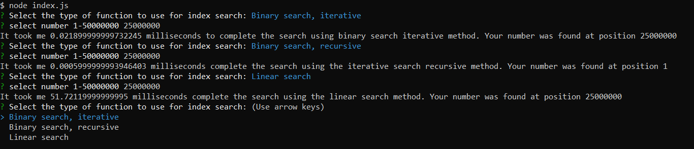

# Search functions speed comparison

## Description

This node application displays the time it takes a function to search for a number in an array. It was build to compare times for linear and binary searches using recursive and iterative methods.

## Table of Contents

- [Product Demonstration](#product-demonstration)
- [Installation](#installation)
- [Usage](#usage)
- [Contributing](#contributing)
- [Tests](#tests)
- [Questions](#questions)
- [License](#license)

## Product Demonstration

## Installation

Clone the respository, run **_npm i_** to install dependencies (inquirer).

## Usage

**NOTE: By default this application will build and populate an array with an index of 50.000.000. This will cause the app to take longer than expected time to start.**

Once started, select the search method you wish to use to iterate though the array in search of a number, and then enter the number you wish to search for.

## Contributing

See contact details at the bottom.

## Tests

N/A

## Questions

Any questions regarding this project can be directed to:

- Email: [tp4458@gmail.com](tp4458@gmail.com)
- GitHub [TP4458](https://github.com/TP4458)

## License

This product is licensed with MIT License. Please click on the badge below, or at the top of this document to find out more.

